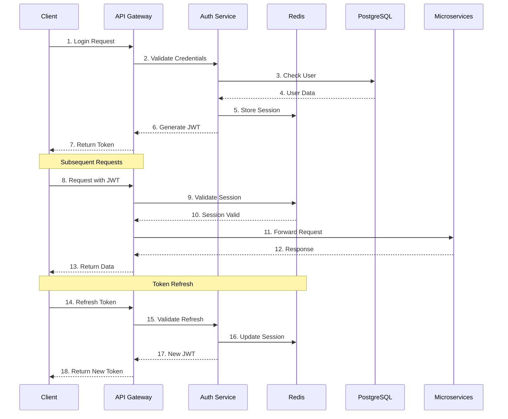

# OBG Plataforma - Olimpíada Brasileira de Geografia

<p align="center">
  
</p>

<p align="center">
  <a href="#sobre">Sobre</a> •
  <a href="#tecnologias">Tecnologias</a> •
  <a href="#arquitetura">Arquitetura</a> •
  <a href="#começando">Começando</a> •
  <a href="#estrutura">Estrutura</a> •
  <a href="#licença">Licença</a>
</p>

## 📋 Sobre

A OBG Plataforma é um sistema moderno desenvolvido para gerenciar a Olimpíada Brasileira de Geografia, integrando escolas, professores e alunos em uma plataforma digital unificada. Com uma arquitetura de microsserviços robusta, o sistema oferece escalabilidade e alta disponibilidade para atender às demandas dos eventos olímpicos.

## 🚀 Tecnologias

### Core
- **TypeScript** (94.3%) - Tipagem estática e maior segurança
- **Node.js** (v22+) - Runtime JavaScript moderno
- **pnpm** (v10.11.0+) - Gerenciador de pacotes eficiente

### Frontend
- **Next.js** - Framework React com SSR/SSG
- **React** - Biblioteca UI componentizada
- **@obg/ui** - Design System proprietário

### Backend
- **NestJS** - Framework Node.js empresarial
- **NATS** - Sistema de mensageria de alta performance
    - Latência ultra-baixa (< 100μs)
    - Padrão Pub/Sub distribuído
    - Suporte a múltiplos protocolos
- **PostgreSQL** - Banco de dados relacional
    - Forte consistência ACID
    - Suporte a dados geoespaciais
- **Redis** - Cache distribuído
    - Cache de sessão
    - Rate limiting
    - Filas de tarefas

### ORM e Validação
- **Prisma ORM** - ORM moderna com type-safety
    - Migrations automáticas
    - Cliente tipado
    - Studio para gestão do banco
- **Zod** - Validação de schemas com TypeScript
    - Inferência de tipos
    - Integração com Swagger
    - Validação runtime

### Autenticação e Segurança
- **Passport** - Middleware de autenticação
    - Múltiplas estratégias
    - JWT e OAuth2
    - Rate limiting

## 🔄 Fluxo de Autenticação



## 🏗 Arquitetura de Serviços



```mermaid
graph TB
    %% Definição de estilos
    classDef container fill:#e1eafe,stroke:#333,stroke-width:2px;
    classDef service fill:#b2d8d8,stroke:#008080,stroke-width:2px;
    classDef database fill:#ffebcd,stroke:#deb887,stroke-width:2px;
    classDef client fill:#98fb98,stroke:#006400,stroke-width:2px;

    %% Camada de Cliente
    subgraph clients[Client Applications]
        WEB[Web App]
        MOBILE[Mobile App]
    end

    %% Infraestrutura Docker
    subgraph docker[Docker Infrastructure]
        %% Message Broker
        subgraph broker[Event Bus]
            NATS[NATS Server]
        end
        
        %% Databases
        subgraph databases[Persistence Layer]
            REDIS[(Redis Cache)]
            POSTGRES[(PostgreSQL)]
        end
    end

    %% API Gateway e Auth
    subgraph gateway[API Layer]
        GATEWAY[API Gateway]
        AUTH[Auth Service]
    end

    %% Microsserviços
    subgraph services[Microservices Layer]
        SCHOOLS[Schools Service]
        TEACHERS[Teachers Service]
        STUDENTS[Students Service]
        EXAMS[Exams Service]
    end

    %% Conexões
    WEB & MOBILE --> GATEWAY
    GATEWAY --> AUTH
    AUTH --> REDIS
    AUTH --> POSTGRES
    
    GATEWAY <--> NATS
    NATS <--> services
    
    services --> POSTGRES
    services --> REDIS

    %% Aplicar estilos
    class WEB,MOBILE client;
    class GATEWAY,AUTH service;
    class SCHOOLS,TEACHERS,STUDENTS,EXAMS service;
    class REDIS,POSTGRES database;
    class NATS container;
```

## 💻 Pré-requisitos

- Node.js 22+
- pnpm 10.11.0+
- Docker e Docker Compose
- PostgreSQL 15+
- Redis 7+

## 📁 Estrutura

```
obg-plataforma/
├── apps/
│   ├── api/               # API Gateway
│   ├── schools-service/   # Serviço de Escolas
│   ├── teachers-service/  # Serviço de Professores
│   ├── students-service/  # Serviço de Alunos
│   ├── exams-service/     # Serviço de Provas
│   ├── web/              # Interface Web
│   └── docs/             # Documentação
├── libs/
│   ├── common/           # Utilitários compartilhados
│   │   ├── decorators/   # Decorators personalizados
│   │   ├── guards/       # Guards de autenticação/autorização
│   │   └── utils/        # Funções utilitárias
│   ├── dtos/            # Data Transfer Objects
│   │   ├── auth/        # DTOs de autenticação
│   │   ├── user/        # DTOs de usuário
│   │   └── shared/      # DTOs compartilhados
│   ├── enums/           # Enumerações compartilhadas
│   ├── interfaces/      # Interfaces e tipos
│   ├── pipes/           # Pipes de transformação/validação
│   └── schemas/         # Schemas Zod/Prisma
├── packages/
│   ├── ui/             # Biblioteca de componentes
│   ├── eslint-config/  # Configurações de ESLint
│   └── typescript-config/ # Configurações de TypeScript
└── docker/
    ├── redis/          # Configuração Redis
    ├── postgres/       # Configuração PostgreSQL
    └── nats/           # Configuração NATS
```

## 🎯 Começando

```bash
# Clone o repositório
git clone https://github.com/vinniciusolliveiracostaa/obg-plataforma.git -b development

# Entre no diretório
cd obg-plataforma

# Instale as dependências
pnpm install

# Configure as variáveis de ambiente
cp .env.example .env

# Inicie os serviços Docker
docker-compose up -d

# Inicie o projeto
pnpm run dev
```

## 🔨 Scripts

- `pnpm run dev` - Inicia todos os serviços em modo de desenvolvimento
- `pnpm run build` - Compila todos os projetos
- `pnpm run test` - Executa os testes
- `pnpm run lint` - Executa o linting do código
- `pnpm run migrate` - Executa as migrations do Prisma
- `pnpm run generate` - Gera os clients do Prisma

## 📄 Licença

Este projeto está sob a licença MIT. Veja o arquivo [LICENSE](LICENSE) para mais detalhes.

---

<p align="center">
  Desenvolvido com 💙 por Vinnicius Oliveira Costa
</p>